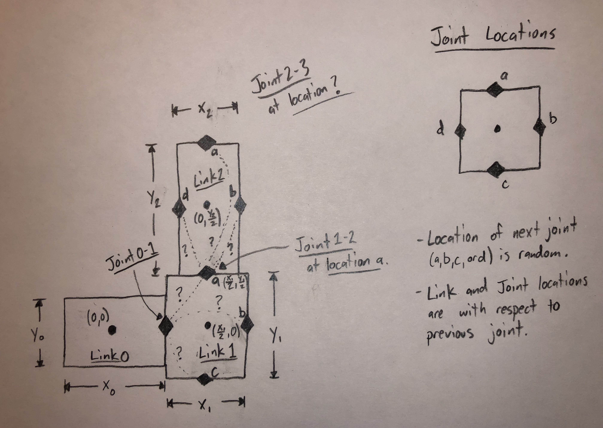

# Hummer - ME 495 - Artifical Life

## Description

- The work carried out here is part of the Artificial Life course taught by[Professor Sam Kriegman](https://www.mccormick.northwestern.edu/research-faculty/directory/profiles/kriegman-sam.html) at *Northwestern University*. 

- The first portion of the course follows the open *LUDOBOTS* course (hence the name of the repository) found on Reddit [here](https://www.reddit.com/r/ludobots/).

- As a part of Ludobots, the [pyrosim github repository](https://github.com/jbongard/pyrosim) was forked and edited as necessary.

- The Ludobots portion of the course concluded with with creation of a quadruped. Following that, were my personal creations - the Catching Crab, and the Random Snake (which will eventually conclude in a final project, but is a necessary milestone).

## Random Snake... Evolved Bodies and Brain

This is the random snake in 3D before and after evolution!

### Creating the bodies
The *Random Snake*, the links and joints are created as follows -->

The following are *pseudo-randomly* selected:
1. The number of links in the body
2. The size of each link
3. The face which the next link will attach to
4. The joint orientation between links
5. Whether a link is a sensor (green) or not (blue)

*Process shown in 2D, but carried out in 3D*
### How is the evolution carried out?

1. A **Parallel-Hill-Climber** algorithm was carried out for **500 generations**
2. For each new generation, a **population size of 10 offspring**, each with a unique mutation, is created and simulated. Note large mutations were avoided in order to avoid *breaking* the body from generation to generation. 
3. The possible mutations are as follows: 
    - A 70% chance that a randomly selected weight of a single sensor-motor neuron within the brain is changed.
    - A 20% chance that the orientation of a randomly selected joint is changed
    - A 10% chane that the size of a randomly selected link is changed
4. If the offspring, with the new mutation, provides a better fitness, it is then saved and used to produce offspring for the following generations. Otherwise, the offspring is thrown out and the parent lives on to produce more offspring.
5. **Fitness** is the absolute value of the distance of the base link from the origin. Directionality was not taken into consideration for this evolutionary process.

The process of how the fitness imporved vs time can be seen for 5 random seeds below!

- To run the Random Snake:
    - Download the repository
    - Be sure to include all files that contain randomSnake______.py
    - Set the random seed number that you would like to evolve in randomSnakeConstants.py
    - Also set the number of generations and the population size you would like to evolve in randomSnakeConstants.py
    - Run **randomSnakeGO.py** to create the random body and begin the simulation

- You can see the full videos **with music** here [(random snake)](https://youtu.be/kGDtNsKyQPk) and here [(random snake in 3D)](https://youtu.be/jUNL5z_xI_Q) and now here [(random snake with evolved brain and body)](https://youtu.be/kMCchMdK9rg)

## The Catching Crab

- To run the Catching Crab:
    - Download the repository
    - Be sure to include Crab__.obj file in order to load the proper body geometry
    - Run **search.py** to begin the simulations
    - The population and generation sizes can be controlled by changing the parameters found in constants.py

- To the full video of the [unevolved](https://youtube.com/shorts/8TvGTw90hCs?feature=share) and [evolved](https://youtube.com/shorts/6lEWiCWt05M?feature=share) catching crab **with music**, go to my youtube channel at the links above.
    - I apologize in advance for the poor video quality!

