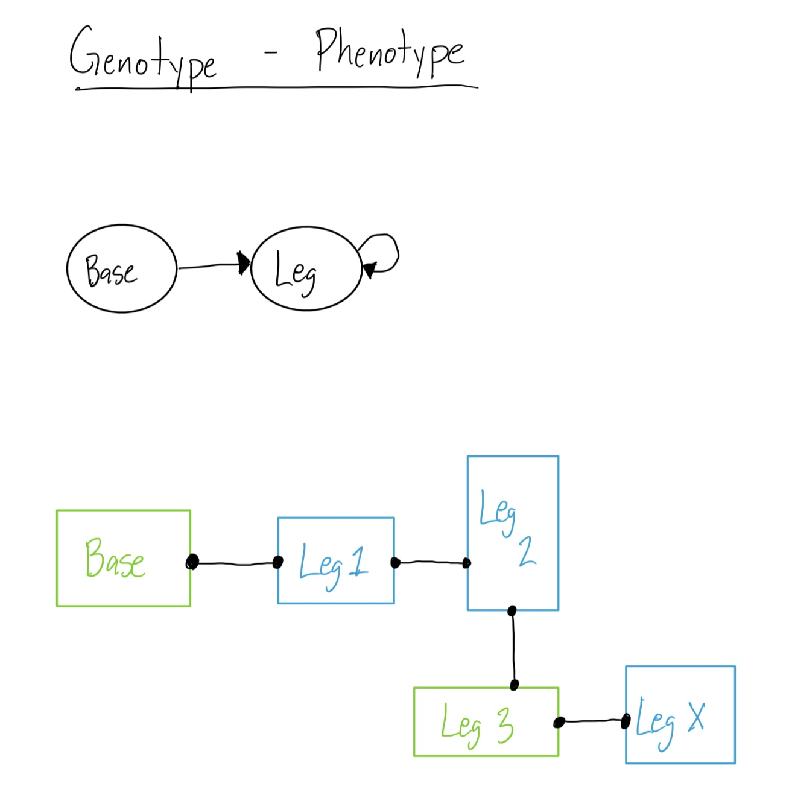
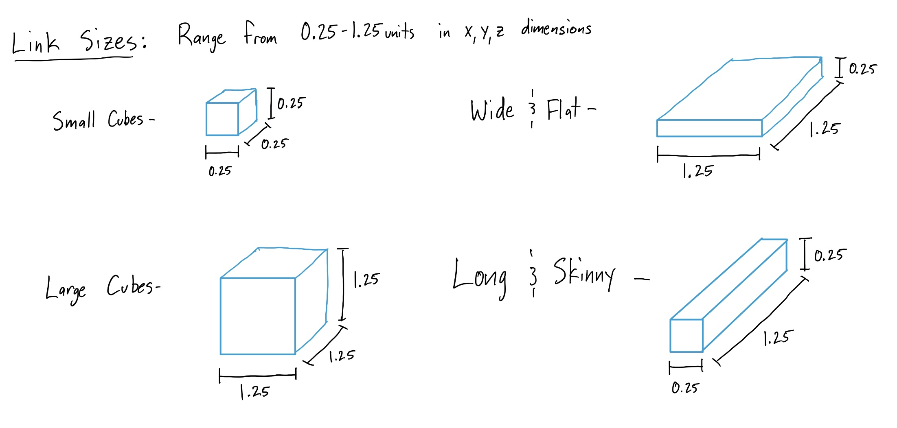
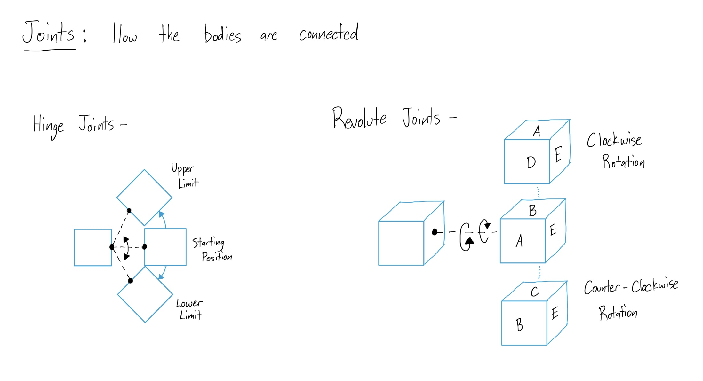
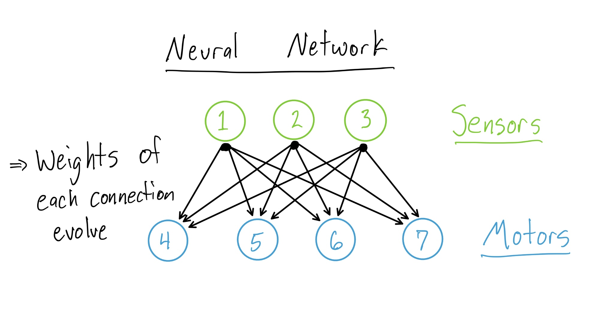
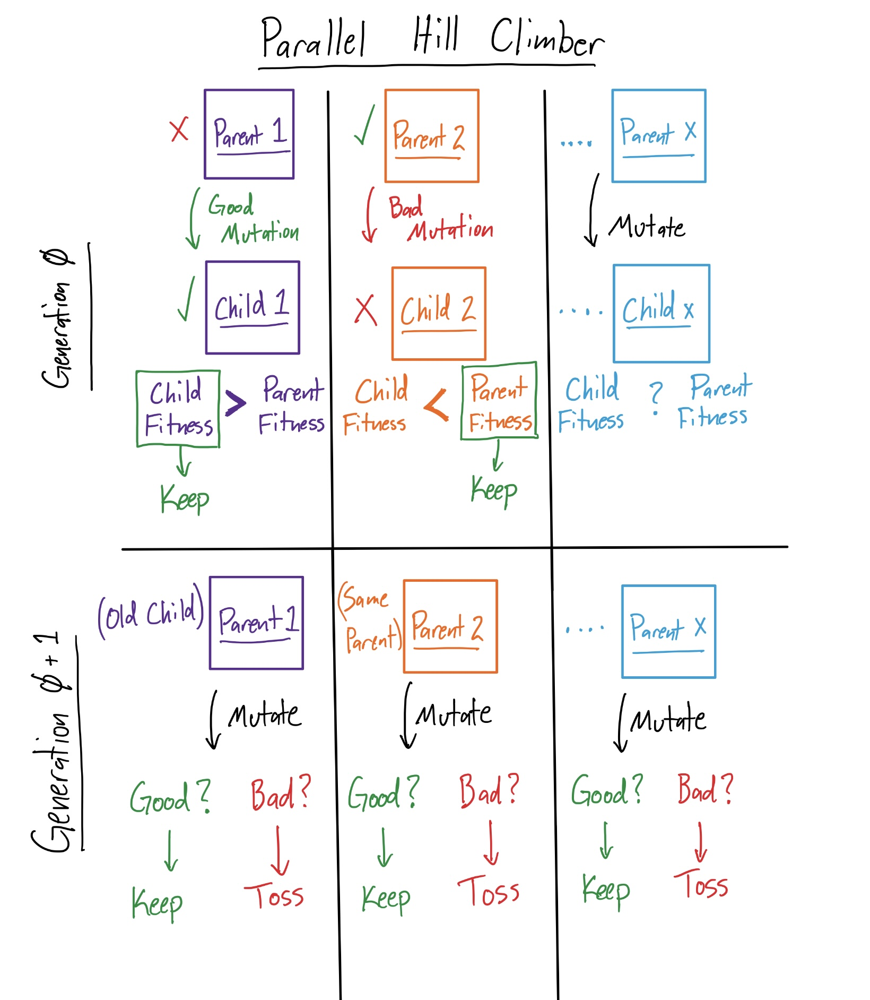
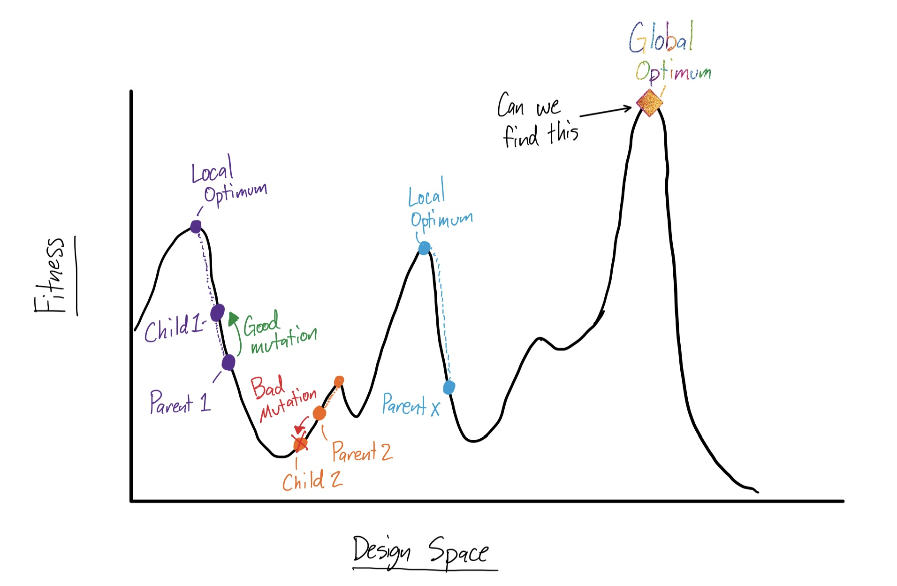
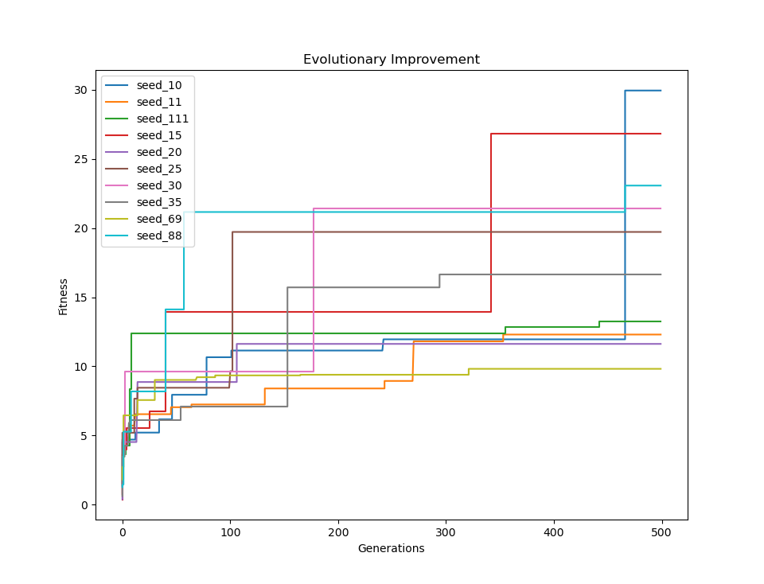

# Hummer - ME 495 - Artifical Life

These are some of my favorite creations before and after evolution!
## Description

- The work carried out here is part of the Artificial Life course taught by [Professor Sam Kriegman](https://www.mccormick.northwestern.edu/research-faculty/directory/profiles/kriegman-sam.html) at *Northwestern University*. 

- The first portion of the course follows the open *LUDOBOTS* course (hence the name of the repository) found on Reddit [here](https://www.reddit.com/r/ludobots/).

- As a part of Ludobots, the [pyrosim github repository](https://github.com/jbongard/pyrosim) was forked and edited as necessary.

- The Ludobots portion of the course concluded with with creation of a quadruped. Following that were my personal creations - the Catching Crab, and my final project (see the video [here](https://youtu.be/KRLQDQqUwek)).

## Running the Program

- Be sure to install pip
- Fork the repo. Be sure to include all files that have randomSnake______.py
- To run evolution:
    - Set the random seed within randomSnakeConstants.py
    - Also set the desired population size and number of generations
    - Sit down and watch evolution take place
- To see the plot of evolution over time:
    - Open randomSnakePlot.py
    - Set the PATH, and make sure all the output .csv files are in the desired directory
    - Run randomSnakePlot.py
- To simulate the most fit robot from each random seed
    - Set the desired random seed within randomSnakeConstants.py
    - Be sure the checkpoint file of the desired seed is in the same directory
    - Run randomSnakeSimBest.py

## Evolved Bodies and Brain

## Creating the bodies
The bodies of the robots, including the links and joints are created as follows -->

The genotype-phenotype mapping for these robots are fairly simple becuase they stem from a single base node, and then evolve in a cascading fashion from that base node with legs.

The following are *pseudo-randomly* selected:
1. The size of each link... some funky shapes can be made even though they are only rectangular prisms

2. The face which the next link will attach to (see the genotype-phenotype image above)
3. The joint orientation between links

4. Whether a link is a sensor (green) or not (blue). The brains consists of fully connected neural networks, where each sensor is connected to each motor.

### How is the evolution carried out?

1. A **Parallel-Hill-Climber** algorithm was carried out for **500 generations**

2. For each new generation, a **population size of 10 offspring**, each with a unique mutation, is created and simulated. Note large mutations were avoided in order to avoid *breaking* the body from generation to generation. Also note, that the parallel-hill-climber works best with a large population size, as the deisgn space is searched more, to find the global optmimum, rather thaan getting stuck in local optima. (see diagram of the deisgn space below)

3. The possible mutations are as follows: 
    - A 70% chance that a randomly selected weight of a single sensor-motor neuron within the brain is changed.
    - A 20% chance that the orientation of a randomly selected joint is changed
    - A 10% chance that the size of a randomly selected link is changed
4. If the offspring, with the new mutation, provides a better fitness, it is then saved and used to produce offspring for the following generations. Otherwise, the offspring is thrown out and the parent lives on to produce more offspring.
5. **Fitness** is the absolute value of the distance of the base link from the origin. Directionality was not taken into consideration for this evolutionary process.

The process of how the fitness imporved vs time can be seen for 10 random seeds below!

- You can see the full videos **with music** here [(random snake)](https://youtu.be/kGDtNsKyQPk) and here [(random snake in 3D)](https://youtu.be/jUNL5z_xI_Q) and now the final project here [(random snake with evolved brain and body)]()

## The Catching Crab

- To run the Catching Crab:
    - Download the repository
    - Be sure to include Crab__.obj file in order to load the proper body geometry
    - Run **search.py** to begin the simulations
    - The population and generation sizes can be controlled by changing the parameters found in constants.py

- To the full video of the [unevolved](https://youtube.com/shorts/8TvGTw90hCs?feature=share) and [evolved](https://youtube.com/shorts/6lEWiCWt05M?feature=share) catching crab **with music**, go to my youtube channel at the links above.
    - I apologize in advance for the poor video quality!

